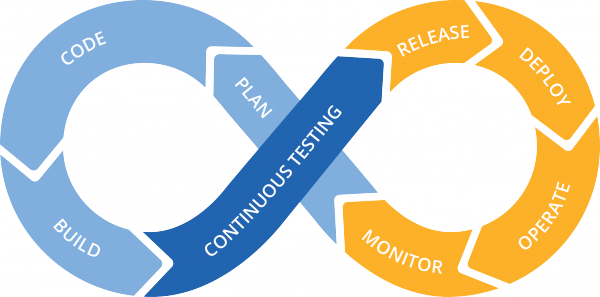

<h1 align="center" style="margin:1em">
  
    <br/> Release Maker
</h1>

<h4 align="center">
  The best way to make a diamond-solid process is to automate it
  <br />
  This README is a blog post originally published at <a href="https://manu.breton.ch/blog/make-release/">manu.breton.ch/blog</a>
</h4>

<p align="center">
  <a href="https://github.com/ebreton/release-maker/blob/master/CHANGELOG.md">
    
  </a>
  <a href="https://github.com/ebreton/release-maker/blob/master/LICENSE">
    
  </a>
</p>
<br>

<!-- TOC depthTo:1 -->

- [A story, where any resemblance to reality is pure coincidence...](#a-story-where-any-resemblance-to-reality-is-pure-coincidence)
- [Objective](#objective)
- [Pre-requisites](#pre-requisites)
- [Set up](#set-up)
    - [files](#files)
    - [environment variables](#environment-variables)
    - [docker](#docker)
    - [versions](#versions)
- [Usage](#usage)
- [Behind the curtains](#behind-the-curtains)
    - [1. a new branch on github rc-X.X.X](#1-a-new-branch-on-github-rc-xxx)
    - [2. a new release on github based on this branch](#2-a-new-release-on-github-based-on-this-branch)
    - [3. an updated Changelog with meaningful information ...](#3-an-updated-changelog-with-meaningful-information)
    - [4. that actually comes from the differences between this release and the previous one](#4-that-actually-comes-from-the-differences-between-this-release-and-the-previous-one)
    - [5. a way to check the current / next version of your code](#5-a-way-to-check-the-current--next-version-of-your-code)
    - [6. an updated badge on your README (because badges are cool)](#6-an-updated-badge-on-your-readme-because-badges-are-cool)
- [Bonus](#bonus)
- [Conclusion](#conclusion)

<!-- /TOC -->

# A story, where any resemblance to reality is pure coincidence...

> [fictitious user] : ... and there I have a page which says five hundred errors. Thats's a lot !  
>   
> [you, not mentioning that 500 is an error code, not the number of errors] :  Hmmm... should not be like this.... which version are you running ?

Ah.

Which version exactly ?

Tricky question... small numbers in the footer of the footer ? hidden comments ? versionned-urls for APIs ? and so on...

> [user] :It says 0.3.1  
>   
> [you] : Thanks. Let me check the Changelog

Ah.

Ah.

Where is the Changelog exactly ?

Do we have one to start with ? Is it up to date ? Has it been written for marketing guys ? Well, chances are huge that if you have a Changelog, it does not really help anyway...

# Objective

In order to facilitate the conversations of the kind above, I would like to present you with a bit of processing and a bit of tooling.

The final objective should be

```
$ make release
...
```

And you would be set with

1. a new branch on github rc-X.X.X
2. a new release on github based on this branch
3. an updated Changelog with meaningful information ...
4. ... that actually comes from the differences between this release and the previous one
5. a way to check the current / next version of your code
6. an updated badge on your README (because badges are cool)

<figcaption>`make release`, one command to rule them all</figcaption>

# Pre-requisites

- make
- your application on github
- docker

Docker will relieve you from installing other dependencies like ruby (used to generate Changelogs) or python (used to manage version)

# Set up

## files

This repository ([**release-maker**](https://github.com/ebreton/release-maker)) is designed as a plugin: you should copy paste the following files into the repository of your app

| File | Description |
| --- | --- |
| ├── Makefile | entrypoint for all commands |
| ├── bin | |
| │   ├── Dockerfile | defines a (very) simple docker image FROM python:3 with the _requests_ library available. The image is built locally with `make build` |
| │   └── update\_release.py | management script, to run sanity checks, update version numbers, publish release to github |
| ├── .env.sample | to define the values of your environment variables |
| └── versions.py | where version numbers are written to/read/imported from |

## environment variables

simply copy-paste (or rename) the _.env.sample_ file to _.env_ and fill in your details:

```
$ cp .env.sample .env
$ vi .env
# GITHUB_* are used for github APIs, to automatically create release & Changelog
GITHUB_OWNER?=repo owner
GITHUB_REPO?=repo name
GITHUB_USER?=your github user
GITHUB_KEY?=your key
CHANGELOG_GITHUB_TOKEN?=${GITHUB_KEY}
```

## docker

Once you have "imported" the repository content and defined your vars, you need to build / pull the docker images that will be used. Otherwise you will get this kind of error:

```
$ make vars
Unable to find image 'python-requests:latest' locally
```

The python image is built locally with `make build`. It is a straightforward _Dockerfile_ that relies on python 3 official image and will have the library _requests_ installed.

```
# bin/Dockerfile
FROM python:3

WORKDIR /usr/src/app
RUN pip install --no-cache-dir requests

ENTRYPOINT ["python"]
CMD ["--help"]
```

Since we are setting up docker, you can actually pull the second image that will generate the Changelog. `make pull` will also run `make build` for you

```
$ make pull
...
```

The command should now work properly (with your values for the environment variables)

```
$ make vars
  Version: 0.1.1-rc

  GITHUB_OWNER=ebreton
  GITHUB_REPO=release-maker
  GITHUB_USER=ebreton
  GITHUB_TOKEN=xxx
  CHANGELOG_GITHUB_TOKEN=xxx
```

## versions

The generation of the Changelog depends on the existence of (at least) one git tag. If you have none, you should run

```
git tag 0.1.0 # or whatever initial version number you prefer
git push --tags
```

You can check the current configuration with

```
$ make version
CHANGELOG GENERATOR:
Version: 1.14.3

APPLICATION:
Version: 0.1.1-rc

Updating release numbers...
INFO - compute - will set _version=0.1.1-rc
INFO - compute - will set _build=5026db3b8b001c5d8991c90d0528161abec7bbeb
INFO - compute - will set _release=0.1.0-12-g5026db3
```

# Usage

Practically, you will only use `make release`, everytime you want to make a release (surprised?)

and that's all.

Of course, there is a few more commands, some we have seen to setup things, some to diagnose or check what the situation is. Here is the list:

| Command | Description | remarks |
| --- | --- | --- |
| `make version` | display the current version of the application (not the one previously deployed), and version of github-changelog-generator | - |
| `make vars` | display value of environment variables | requires _.env_ file |
| `make build` | build a docker image FROM python:3 with requests available | - |
| `make pull` | pull last docker image of github-changelog-generator | - |
| `make ps` | list docker containers (with less information than docker ps) | - |
| `make changelog` | build/update new version of Changelog according to tags and PRs | valid environment variables must be defined in _.env_ (or environment) |
| `make release` | after confirmation of version number, execute all release process. | must be executed in branch **master** |
| `make push-qa` | update tag **qa-release** and rebuild Changelog | - |
| `make push-prod` | update tag q **a-release** and rebuild Changelog | ask confirmation of branch and version |

We have not yet discussed the last two lines... there is some kind of bonus behind them, that will see in the last section.

# Behind the curtains

I guess you see it coming :

## 1. a new branch on github rc-X.X.X

this acts as an emergency branch, in case when a quick fix is needed

## 2. a new release on github based on this branch

this allows to update the badge or get the release number from github API

## 3. an updated Changelog with meaningful information ...

this is the mandatory context that you will be looking for to diagnose any issue

## 4. that actually comes from the differences between this release and the previous one

Thanks [ferrarimarco](https://github.com/ferrarimarco/docker-github-changelog-generator) !

## 5. a way to check the current / next version of your code

thanks to _versions.py_ which you can import and use anywhere in your code

## 6. an updated badge on your README (because badges are cool)

indeed

# Bonus

> Using git tags for continuous integration and continuous deployment

If you happen

1. to run your applications within docker containers,
2. and have setup automated builds in your registry (or docker hub),
3. to use an orchestrator

It is convenient to use tags for continuous integration and deployment

In my case, the orchestrator relies on the `qa-release` tag to upgrade the integration environment, and on the `prod-release` tag to upgrade the production.

It is all automated, except for the trigger, which remains on your hand. Therefore, running `make release` will call `make push-qa`, and start the upgrade process for integration. You can also upgrade without going through all the release process, by calling yourself `make push-qa` (no confirmation)

In order to update production, you must call `make push-prod`, which will ask for your confirmation.

Be aware that those two commands will update your Changelog (by calling `make changelog`), because we want it up to date with the commits that are pointed out by each tag.

```
$ make push-qa
# update tags
git tag -f qa-release
Updated tag 'qa-release' (was db42b2e)
git push --tags --force
...

$ make push-prod
You are on branch 'master'
on version '0.1.2-rc'

Type [y] to comfirm push
or any other key to abort:
...
```

Needless to say, if you haven't configured your orchestrator to update containers based on new builds, and if you haven't configured your registry to update builds based on git tags.... well... those two commands above will not be so useful.

# Conclusion

I cannot stress enough the conveniency of automatic versioning and releasing, along with a consistent (auto-magically generated) Changelog. It just saved hours of team-work to support the final users and diagnose the issues.

Within my team, we were aware of it for a long time, and we had tried hard to structure our Pull Requests, our Changelog, our version numbers. But that just could not work as long as it was manual. Too cumbersome, with absolutely no value (until the shit hit the fan).

Firstofall _release maker_ has allowed us to focus on development, on the content of the reviews. Secondly, it  has facilitated the release process so much that we could actually increase dramatically our release frequency, from once a month to once a week (sometimes more).

Nice. Handy.

Hope you will find it useful too :)