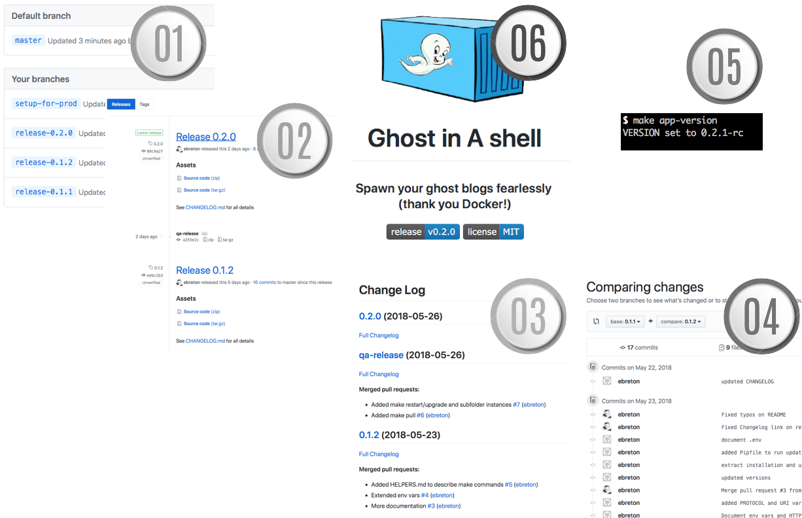

Release-maker
=

> The best way to enforce a diamond-solid process... is to automate it

Table of Content
--

<!-- TOC -->

- [Objective](#objective)
- [Pre-requisites](#pre-requisites)
- [Setup](#setup)
- [Usage](#usage)

<!-- /TOC -->

## Objective 

Here are a bit of processing and a bit of tooling to automate the release process. You will use mainly the following command

    $ make release
    ...

Which will offer you:

1. a new branch on github rc-X.X.X
1. a new release on github based on this branch
1. an updated Changelog with meaningful information ...
1. ... that actually comes from the differences between this release and the previous one
1. a way to check the current / next version of your code
1. an updated badge on your README (because badges are cool)

## Pre-requisites

- the content of the repo [**release-maker**](https://github.com/ebreton/release-maker)
- **docker**, in order to generate automatically the CHANGELOG file
- **python** (could be 2.7 or 3.x) to manage version numbers and nearly everything else

## Setup

The script depends on the existence of (at least) one git tag. If you have none, you should run

    git tag 0.1.0
    git push --tags

In order to publish release to github, the python library requests needs to be installed. `pip install` will do, preferably within a virtual environment. A *Pipfile* is provided for this purpose

    $ pipenv install
    ...
    $ pipenv shell
    $ make release
    ...

## Usage

Command | Description | remarks
---------|----------|----------
 `make version` | display the current version of the application (not the one previously deployed), and version of github-changelog-generator | -
 `make vars` | display value of environment variables | requires *.env* file
 `make pull` | pull last docker image of github-changelog-generator | -
 `make ps` | list docker containers (with less information than docker ps) | -
 `make changelog` | builds new version of Changelog according to tags and PRs | valid environment variables must be defined in .env (or environment)
 `make release` | after confirmation of version number, execute all release process. | must be executed in branch **master**
 `make push-qa` | update tag **qa-release** and rebuild Changelog | -
 `make push-prod` | update tag q**a-release** and rebuild Changelog | ask confirmation of branch and version

 ## As a bonus

 ### git hook: automatic upgrade build and commit releases

$ cp update_release.py .git/hooks/post-commit

Just make sure that your python executable is aligned with the one declared in the hook

    $ which python
    /usr/bin/python

    # if your path is different, change it in the first line of the post-commit file
    $ vi .git/hooks/post-commit
    ...

 ### git tags: continuous integration and continuous deployment

    $ make push-qa
    ...

    $ make push-prod
    ...
